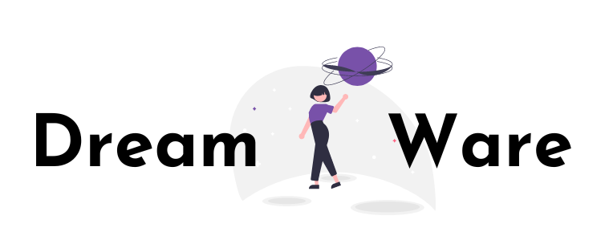

<!-- PROJECT LOGO -->
<br />
<div align="center">
  <a href="https://github.com/NasirAbdirahman/Django-Dashboard">
    
  </a>

  <h3 align="center">DreamWare</h3>

  <p align="center">
    A community of transitioning software engineers
    <br />
    <a href="https://github.com/NasirAbdirahman/Django-Dashboard"><strong>Explore the code »</strong></a>
    <br />
    <br />
    <a href="">Live Demo coming soon..</a>
  </p>
</div>


<!-- TABLE OF CONTENTS -->
<details>
  <summary>Table of Contents</summary>
  <ol>
    <li>
      <a href="#about-the-project">About The Project</a>
      <ul>
        <li><a href="#built-with">Built With</a></li>
      </ul>
      <ul>
        <li><a href="#features">features</a></li>
      </ul>
    </li>
    <li>
      <a href="#getting-started">Getting Started</a>
      <ul>
        <li><a href="#prerequisites">Prerequisites</a></li>
        <li><a href="#installation">Installation</a></li>
      </ul>
    </li>
    <li><a href="#usage">Usage</a></li>
    <li><a href="#roadmap">Roadmap</a></li>
    <!--<li><a href="#contributing">Contributing</a></li>
    <li><a href="#license">License</a></li>-->
    <li><a href="#contact">Contact</a></li>
    <li><a href="#acknowledgments">Acknowledgments</a></li>
  </ol>
</details>


<!-- ABOUT THE PROJECT -->
## About The Project

Dreamware is a membership site that connects individuals that are transitioning into software engineers and companies wishing to hire them. Hailing from multiple industries, they share a common dream, to enter the tech industry.  Whether they are bootcamp grads, self-taught programmers, or current students, Dreamware allows them to share their profiles, skills and connect with top companies that are sourcing for diverse, multi-disciplinary talent to fill positions.

<p align="right">(<a href="#top">back to top</a>)</p>


### Built With

* [Django.js](https://www.djangoproject.com/)


<p align="right">(<a href="#top">back to top</a>)</p>


### Features
<strong>Overall:</strong>The home page explaining membership advantage for candidates. The companies page explaining partner advantage for companies. The Register page for visitors to create either a member or company account. The login page for members to login to the site.


https://user-images.githubusercontent.com/73849492/167973896-a36cb2ab-33b1-40a2-a2e5-3ab203297488.mp4


<strong>Member Access-Only:</strong>Member dashboard showcasing their personal information, contact info, technology skills and top companies that their skills have matched with. Member’s Profile editing page. The jobs page for members to view all active partner companies’ job listings.


https://user-images.githubusercontent.com/73849492/167975222-d857adf3-302b-4bcb-b612-5645ce162ce0.mov


<strong>Company Access-Only:</strong>Company representative dashboard showcasing their personal information, company information, copy of job posting that candidates’ currently see, and top candidates’ whose skills have matched their job post. Company representative Profile editing page. The candidates’ page for companies to view all active Dreamware candidates.


https://user-images.githubusercontent.com/73849492/167976335-d2983062-6276-4dc6-8408-462028985167.mov


<p align="right">(<a href="#top">back to top</a>)</p>


<!-- GETTING STARTED -->
## Getting Started

To view the website locally. Follow the simple example steps below.

### Prerequisites

* Python - Install from (https://www.python.org/downloads/)
* Pipenv - (requires 'pip', if you donwload Python from above source, already installed)
  ```sh
  pip install pipenv
  ```


### Installation

1. Clone project
  * Download ZIP File from repo, Unzip file & open folder in IDE of your choice.

2. Install ALL project Packages/Dependencies in Pipenv shell
  * Open pipenv shell in terminal
     ```sh
     pipenv shell
     ```
  * Install dep./pack. in shell
   ```sh
   pipenv install --dev
   ```
3. Launch Project
  * navigate into folder
   ```sh
   cd techjourneyproject
   ```
   * Launch
   ```sh
   python manage.py runserver
   ```
   * Navigate to localhost


<p align="right">(<a href="#top">back to top</a>)</p>


<!-- USAGE EXAMPLES -->
## Usage

Use this space to show useful examples of how a project can be used. Additional screenshots, code examples and demos work well in this space. You may also link to more resources.

_For more examples, please refer to the [Documentation](https://example.com)_

<p align="right">(<a href="#top">back to top</a>)</p>


<!-- ROADMAP -->
## Roadmap

- [x] Add Changelog
- [x] Add back to top links
- [ ] Add Additional Templates w/ Examples
- [ ] Add "components" document to easily copy & paste sections of the readme
- [ ] Multi-language Support
    - [ ] Chinese
    - [ ] Spanish

See the [open issues](https://github.com/othneildrew/Best-README-Template/issues) for a full list of proposed features (and known issues).

<p align="right">(<a href="#top">back to top</a>)</p>


<!-- CONTRIBUTING 
## Contributing

Contributions are what make the open source community such an amazing place to learn, inspire, and create. Any contributions you make are **greatly appreciated**.

If you have a suggestion that would make this better, please fork the repo and create a pull request. You can also simply open an issue with the tag "enhancement".
Don't forget to give the project a star! Thanks again!

1. Fork the Project
2. Create your Feature Branch (`git checkout -b feature/AmazingFeature`)
3. Commit your Changes (`git commit -m 'Add some AmazingFeature'`)
4. Push to the Branch (`git push origin feature/AmazingFeature`)
5. Open a Pull Request

<p align="right">(<a href="#top">back to top</a>)</p>-->


<!-- LICENSE
## License

Distributed under the MIT License. See `LICENSE.txt` for more information.

<p align="right">(<a href="#top">back to top</a>)</p> -->


<!-- CONTACT -->
## Contact

Your Name - [@your_twitter](https://twitter.com/your_username) - email@example.com

Project Link: [https://github.com/your_username/repo_name](https://github.com/your_username/repo_name)

<p align="right">(<a href="#top">back to top</a>)</p>


<!-- ACKNOWLEDGMENTS -->
## Acknowledgments

Use this space to list resources you find helpful and would like to give credit to. I've included a few of my favorites to kick things off!

* [Choose an Open Source License](https://choosealicense.com)
* [GitHub Emoji Cheat Sheet](https://www.webpagefx.com/tools/emoji-cheat-sheet)
* [Malven's Flexbox Cheatsheet](https://flexbox.malven.co/)
* [Malven's Grid Cheatsheet](https://grid.malven.co/)
* [Img Shields](https://shields.io)
* [GitHub Pages](https://pages.github.com)
* [Font Awesome](https://fontawesome.com)
* [React Icons](https://react-icons.github.io/react-icons/search)

<p align="right">(<a href="#top">back to top</a>)</p>


<!-- MARKDOWN LINKS & IMAGES -->
<!-- https://www.markdownguide.org/basic-syntax/#reference-style-links -->
[contributors-shield]: https://img.shields.io/github/contributors/othneildrew/Best-README-Template.svg?style=for-the-badge
[contributors-url]: https://github.com/othneildrew/Best-README-Template/graphs/contributors
[forks-shield]: https://img.shields.io/github/forks/othneildrew/Best-README-Template.svg?style=for-the-badge
[forks-url]: https://github.com/othneildrew/Best-README-Template/network/members
[stars-shield]: https://img.shields.io/github/stars/othneildrew/Best-README-Template.svg?style=for-the-badge
[stars-url]: https://github.com/othneildrew/Best-README-Template/stargazers
[issues-shield]: https://img.shields.io/github/issues/othneildrew/Best-README-Template.svg?style=for-the-badge
[issues-url]: https://github.com/othneildrew/Best-README-Template/issues
[license-shield]: https://img.shields.io/github/license/othneildrew/Best-README-Template.svg?style=for-the-badge
[license-url]: https://github.com/othneildrew/Best-README-Template/blob/master/LICENSE.txt
[linkedin-shield]: https://img.shields.io/badge/-LinkedIn-black.svg?style=for-the-badge&logo=linkedin&colorB=555
[linkedin-url]: https://linkedin.com/in/othneildrew
[product-screenshot]: images/screenshot.png
